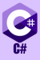

I am an Informatics Student passionate about software development, problem solving, and building practical applications.
I like to create projects that strengthen my understanding of data structures, algorithms, and software engineering.

## Main Language

<table>
<tr>
<td align="right">
  
  
</td>
</tr>
</table>

## Currently Learning

<table>
<tr>
<td align="right">
  
  
  
  
  
  
</td>

## Future Projects

- Personal Finance Tracker (next project)
- Reminder app
- File organizer

## Future Goals

- Build a game
- Build a software
- Build a website

## Socials

- <a href="https://www.instagram.com/mosesrelith/">"Instagram</a>
- <a href="https://x.com/mosesrelith">"X</a>
