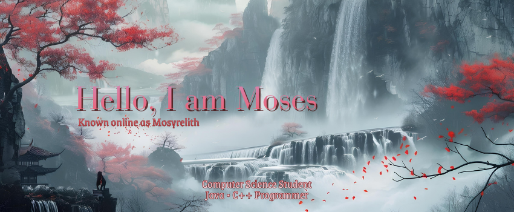
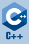

I am an Informatics Student passionate about software development, problem solving, and building practical applications.
I like to create projects that strengthen my understanding of data structures, algorithms, and software engineering.

## Main Language

<h2>
  
  
</h2>

## Currently Learning

## Future Projects

I can do basic Java and C++. Currently learning other language, such as JavaScript, Python, C#, and PHP.

<!--

I'm currently working on
I'm currently learning
I'm looking to collaborate on
I'm looking for help with
Ask me about
How to reach me:
Pronouns:
Fun fact:

-->
